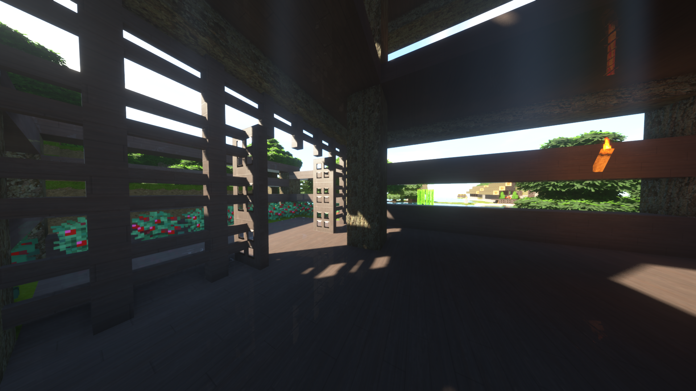

 ## Solución de Ecuaciones no lineales #
  **David Becerra**
  **Aldo Valdez**

**Posibles Metodos necesarios**

*Métodos de bisección*
*Método de la falsa posición y método de la falsa posición modificada*
*Método de Newton*
*Método de la secante*
*Método de sustitución sucesiva*
*Método de Bairstow*

#### ¿Por que esto? ####

Existen ecuaciones cuya solución, mediante técnicas algebraicas tradicionales,
pueden resultar difíciles de obtener, y es cuando podemos utilizar otros métodos para
aproximarnos a la solución.